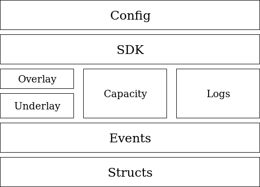

## Architecture Overview

[TODO]

### Layer Summary

The lowermost layer is the **Structs layer** which provides the data structures
that we use in the other packages. The core of the simulation is **an Events library** which runs the simulation using a **lazy event queue**. Over that, we distinguish 3 main packages: the latency-related packages(**Underlay, Overlay
and Models**), the **capacity package** and the **metrics package**.
The **Underlay** models the latencies at the network layer, providing realistic topologies.
The **Overlay** mainly abstracts the **Underlay** particularities away by providing an interface towards via naming abstractions and packet layering. The **Overlay** represents the transport layer encapsulation.
Finally, the **Models** module is used to represent application-level events such as a node joining the peer-to-peer network or a query being issued.

The **Capacity** package is used to model bandwidth. It seamlessly operates with the latency module to provide the network model.
The working model follows the TCP high-level description in order to allow a
high number of nodes to be simulated on commodity hardware.
The **Metrics** package is a package used to monitor the simulation. Finally, at the highest level, we have the **SDK and Interfaces**
packages which expose to the exterior the packet transport primitives and the interfaces that need to be implemented by the user.
Moreover, the SDK provides a **simulation builder** which can be used to define and fine-tune the simulations.

### Module details

- [Event simulator](events.md)
- [Latency](latency.md)
- [Capacity](capacity.md)
- [Optimizations](optimizations.md)
